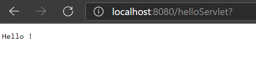
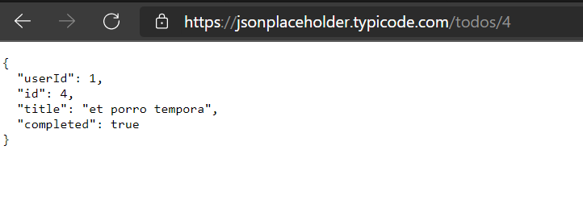
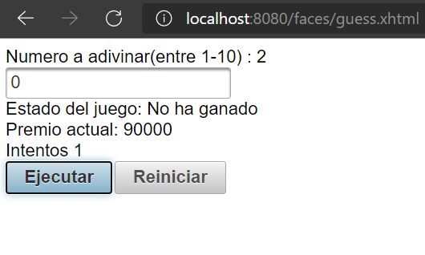

# CVDSLAB5

## Parte I. - Jugando a ser un cliente HTTP
### 1. Abra una terminal Linux o consola de comandos Windows.
### 2. Realice una conexión síncrona TCP/IP a través de Telnet al siguiente servidor:
- Host: www.escuelaing.edu.co
- Puerto: 80
- Teniendo en cuenta los parámetros del comando telnet: `telnet HOST PORT`

### 3. Antes de que el servidor cierre la conexión por falta de comunicación:
- Revise la página 36 del RFC del protocolo HTTP, sobre cómo realizar una petición GET. Con esto, solicite al servidor el recurso ‘sssss/abc.html’, usando la versión 1.0 de HTTP.
- Asegúrese de presionar ENTER dos veces después de ingresar el comando.
- Revise el resultado obtenido. ¿Qué codigo de error sale?, revise el significado del mismo en la lista de códigos de estado HTTP.
- ¿Qué otros códigos de error existen?, ¿En qué caso se manejarán?

Al ejecutar el comando del paso anterior, vemos que no podemos ver lo que escribimos, junto con la consola de comandos de Windows negra totalmente.  Después, vemos que aparece el error 400, que representa Bad Request o una solicitud incorrecta, que significa que el servidor no puede o no procesará la solicitud debido a un aparente error del cliente. 

#### Error 401: Unauthorized:
Forbidden, pero específicamente para usar cuando se requiere autenticación y ha fallado o aún no se ha proporcionado. La respuesta debe incluir un campo de encabezado WWW-Authenticate que contenga un desafío aplicable al recurso solicitado. Consulte Autenticación de acceso básica y Autenticación de acceso Digest. 401 semánticamente significa "no autorizado", el usuario no tiene credenciales de autenticación válidas para el recurso de destino.

#### Error 402: Payment Required:
Reservado para uso futuro. La intención original era que este código se pudiera usar como parte de alguna forma de efectivo digital o esquema de micropagos, como lo propuso, por ejemplo, GNU Taler, pero eso aún no ha sucedido y este código no se usa ampliamente. La API de Google Developers usa este estado si un desarrollador en particular ha superado el límite diario de solicitudes. Sipgate usa este código si una cuenta no tiene fondos suficientes para iniciar una llamada. Shopify usa este código cuando la tienda no ha pagado sus tarifas y está temporalmente inhabilitada. Stripe usa este código para pagos fallidos donde los parámetros eran correctos, por ejemplo, pagos fraudulentos bloqueados.

#### Error 403: Forbidden:
La solicitud contenía datos válidos y fue entendida por el servidor, pero el servidor rechaza la acción. Esto puede deberse a que el usuario no tiene los permisos necesarios para un recurso o necesita una cuenta de algún tipo, o al intentar una acción prohibida (por ejemplo, crear un registro duplicado donde solo se permite uno). Este código también se usa normalmente si la solicitud proporcionó autenticación respondiendo al desafío del campo de encabezado WWW-Authenticate, pero el servidor no aceptó esa autenticación. La solicitud no debe repetirse.

#### Error 404: Not Found:
No se pudo encontrar el recurso solicitado, pero es posible que esté disponible en el futuro. Se permiten solicitudes posteriores por parte del cliente.

### 4. Realice una nueva conexión con telnet, esta vez a:
- Host: www.httpbin.org
- Puerto: 80
- Versión HTTP: 1.1 Ahora, solicite (GET) el recurso /html. ¿Qué se obtiene como resultado?
Luego de ejecutar el comando telnet `www.httpbin.org 80`

### 5. Seleccione el contenido HTML de la respuesta y copielo al cortapapeles CTRL-SHIFT-C. Ejecute el comando wc (word count) para contar palabras con la opción -c para contar el número de caracteres:

Pegue el contenido del portapapeles con CTRL-SHIFT-V y presione CTRL-D (fin de archivo de Linux). Si no termina el comando wc presione CTRL-D de nuevo. No presione mas de dos veces CTRL-D indica que se termino la entrada y puede cerrarle la terminal. Debe salir el resultado de la cantidad de caracteres que tiene el contenido HTML que respondió el servidor.

Claro está, las peticiones GET son insuficientes en muchos casos. Investigue: ¿Cuál es la diferencia entre los verbos GET y POST? ¿Qué otros tipos de peticiones existen?

Luego de guardar el contenido del HTML en un txt, y ejecutar el comando wc -c, vemos que nos aparece el conteo total de caracteres, de la siguiente forma.

La diferencia entre los métodos GET y POST radica en la forma de enviar los datos a la página cuando se pulsa el botón “Enviar”. Mientras que el método GET envía los datos usando la URL, el método POST los envía de forma que no podemos verlos (en un segundo plano u "ocultos" al usuario).

### 6. En la practica no se utiliza telnet para hacer peticiones a sitios web sino el comando curl con ayuda de la linea de comandos:

¿Cuáles son las diferencias con los diferentes parámetros?

Luego de ejecutar el comando curl www.httpbin.org, vemos que nos aparece todo el código HTML de la página web www.httpbin.org.  Después, al ejecutar el comando curl -v www.httpbin.org, vemos que nos muestra detalladamente que hizo una conexión a la dirección IP 3.221.81.55 por el puerto 80, realiza el GET al host www.httpbin.org, el cual muestra que ha sido Aceptado, y después si muestra el HTML de la página web.  Ahora, al ejecutar el comando curl -i www.httpbin.org, vemos que a diferencia del comando curl -v www.httpbin.org, este al principio no muestra información detallada del GET, sino que muestra la fecha y hora en que se realizó la consulta del HTML, acompañado del tipo, que es HTML, la longitud, el tipo de conexión, el servidor al que se conectó, y luego si el código HTML. 


## Parte II. - HACIENDO UNA APLICACIÓN WEB DINÁMICA A BAJO NIVEL.

3.Revise en el pom.xml para qué puerto TCP/IP está configurado el servidor embebido de Tomcat (ver sección de plugins).
```
 <!-- Tomcat embedded plugin. -->
       <plugin>
           <groupId>org.apache.tomcat.maven</groupId>
           <artifactId>tomcat7-maven-plugin</artifactId>
           <version>2.2</version>
           <configuration>
               <port>8080</port>  <---- puerto 
               <path>/</path>
           </configuration>
       </plugin>
   </plugins>
```
5. Abra un navegador, y en la barra de direcciones ponga la URL con la cual se le enviarán peticiones al ‘SampleServlet’. Tenga en cuenta que la URL tendrá como host ‘localhost’, como puerto, el configurado en el pom.xml y el path debe ser el del Servlet. Debería obtener un mensaje de saludo.



6. Observe que el Servlet ‘SampleServlet’ acepta peticiones GET, y opcionalmente, lee el parámetro ‘name’. Ingrese la misma URL, pero ahora agregando un parámetro GET (si no sabe como hacerlo, revise la documentación en http://www.w3schools.com/tags/ref_httpmethods.asp).


7. Busque el artefacto gson en el repositorio de maven y agregue la dependencia.
```
<dependency>
	    <groupId>com.google.code.gson</groupId>
	    <artifactId>gson</artifactId>
	    <version>2.8.5</version>
	</dependency>
```
8. En el navegador revise la dirección https://jsonplaceholder.typicode.com/todos/1. Intente cambiando diferentes números al final del path de la url.





14. verifique el funcionamiento de la aplicación, recompile y ejecute la aplicación.  


15. Intente hacer diferentes consultas desde un navegador Web para probar las diferentes funcionalidades.  


## Parte III. 
20. Recompile y ejecute la aplicación. Abra en su navegador en la página del formulario, y rectifique que la página hecha anteriormente sea mostrada. Ingrese los datos y verifique los resultados. Cambie el formulario para que ahora en lugar de POST, use el método GET . Qué diferencia observa?

**ej 1 :**   


**ej 2 :**   


## Parte IV.
9. Para verificar el funcionamiento de la aplicación, agregue el plugin tomcat-runner dentro de los plugins de la fase de construcción (build). Tenga en cuenta que en la configuración del plugin se indica bajo que ruta quedará la aplicación:





10 - c  

el bean de secion y de aplicacion no genero ningun cambio : 


10 - d  


11
lista  
  

reinicio  
  


